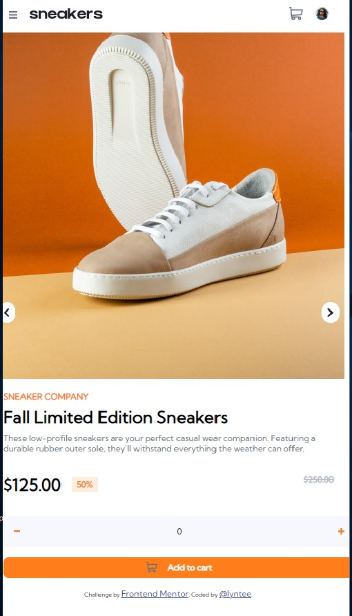
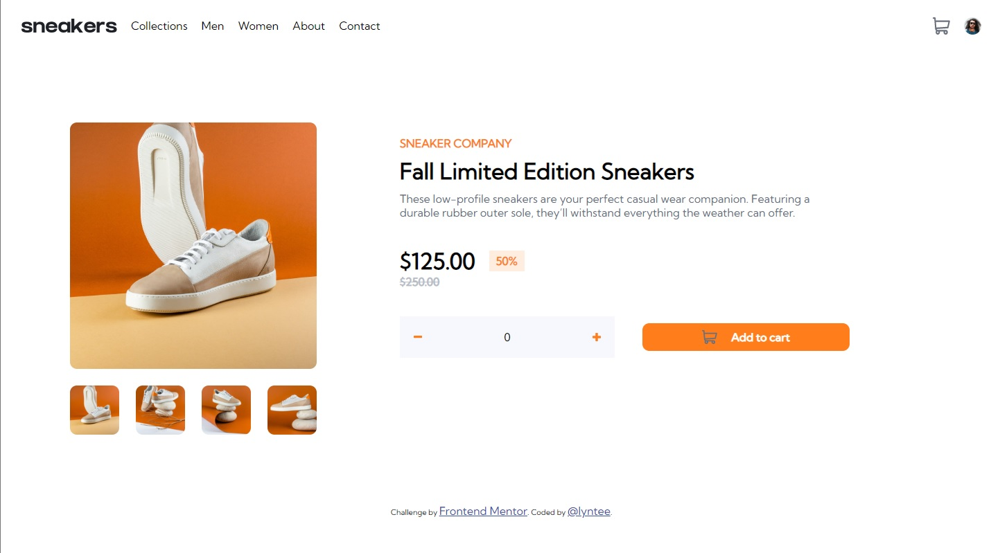

# E-commerce product page by Frontend Mentor

This is a challenge by Frontend Mentor [E-commerce product page challenge on Frontend Mentor](https://www.frontendmentor.io/challenges/ecommerce-product-page-UPsZ9MJp6). 

## Table of contents

- [Overview](#overview)
  - [The challenge](#the-challenge)
  - [Screenshot](#screenshot)
  - [Links](#links)
- [My process](#my-process)
  - [Built with](#built-with)
  - [Functionalities of web page](#functionalities-of-web-page)
  - [Continued development](#continued-development)

## Overview

### The challenge

Users should be able to:

- View the optimal layout for the site depending on their device's screen size
- See hover states for all interactive elements on the page
- Open a lightbox gallery by clicking on the large product image
- Switch the large product image by clicking on the small thumbnail images
- Add items to the cart
- View the cart and remove items from it

### Screenshot

### Links

- [Live Page](https://lyntee.github.io/sneakers)

## My process

### Built with

- Semantic HTML5 markup
- CSS custom properties
- Flexbox
- Mobile-first workflow

### Functionalities of web page

- Side Menu (accessible upon click event)
- Image Silder (Mobile) / Lightbox Gallery (Web)
- Adding items to cart
  - if number of items < 0, nothing will be added
  - else item will be added
- Cart Details Display
  - if cart is empty, a note will be displayed
  - else cart items will be displayed

### Continued development

 I hope that I will be able to recreate this project with React.js and API.
